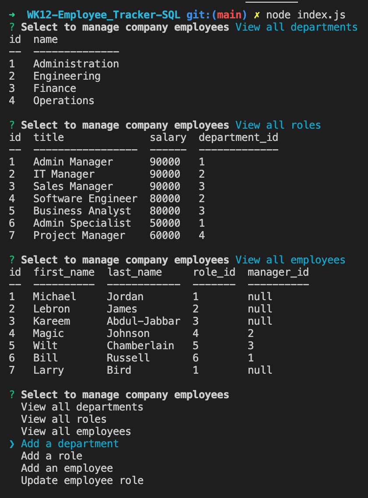

# Employee Tracker
  
  ## Description

  This command-line application will allow users to manage a company's employee database. The user will be able to view and manage the departments, roles, and employees in the company

  ## Video Recording
  [WALK-THROUGH VIDEO] https://drive.google.com/drive/u/0/folders/1PTO-G1xw3tOVAiRDkG4HLcEekH2Wf4wD

  ## Screenshot
  

  ## Table of Contents
  #### [Installation](#installation)
  #### [Usage](#usage)
  #### [Contribution](#contribution)
  #### [License](#license)
  #### [Contact](#questions)

  ## Installation

  With the terminal open, run command npm i to install the necessary dependencies. Then, run the database and its seeds file by running command mysql -u root -p, enter credentials, run command SOURCE db/schema.sql; , run command SOURCE db/seeds.sql; , and type exit in that order . Finally, run command node index.js to initiate the application.

  ## Usage

  Navigate through each command and select preferred command. Answer prompts when necessary

  ## Contribution

  Submit a pull request

  ## License

  

  ## Github Repository

  Github: 
  
